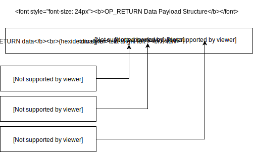
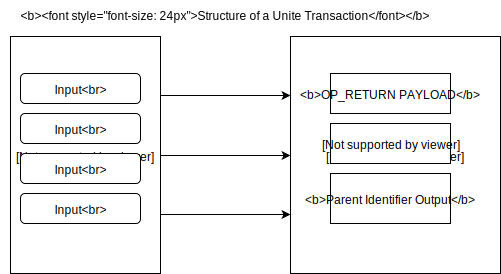

# Overview

The Unite protocol is an extremely simple, extensible and powerful layer 2 protocol for representing hierarchical structures of data. At layer 1, a blockchain is utilized for immutably storing Unite transaction data. At the most basic level, there are two elements which make up a valid Unite post, described below.

Before we explore these elements, the definition of a "post" should be clarified:

**A "post" in this context refers to any action taken by a user. This should be thought of like an HTTP "POST" request, not as a "post" on Facebook. There are different "post types" which differentiate between things like replies, likes, tips and content publication, discussed below.**

The first of the two requirements for a post to be valid is that it must have a parent. The parent must be a valid layer 1 blockchain address for receiving payments. For a layer 1 transaction to be considered a valid layer 2 (Unite) post, it must contain an output sending a non-zero amount of funds to a valid layer 1 blockchain address.

The second requirement for valid posts is that they must contain some data. Utilizing OP_RETURN (in bitcoin-like networks), or other methods for other blockchains, all layer 1 transactions which are also valid layer 2 (Unite) posts must, in addition to a parent, contain a transaction output encoding a data payload.

In order for the layer 1 transaction to be a valid layer 2 (Unite) post, the data payload must be encoded in accordance with these specifications:

- The payload must begin with the Unite network-wide prefix code as the first byte
- The payload must provide the message prefix code, which defines the type of the post
- If required by the specified message prefix, any subsequent data relating to the post

## Transaction Structure

The structure of a valid Unite transaction on a layer 1 network is depicted by the following diagram:

A transaction may have as many inputs as are needed to fulfill the outputs. Inputs are not relevant to the Unite protocol, except that they must all be from the same address. The input address is the sender of the post.

If all outputs (except the data payload) are sent to the sender's address, the parent for the post will be the sender. Otherwise, the parent will be the first address referenced by an output that is not the sender's address. If multiple other addresses (besides the sender) exist, the post is invalid as it can only have one parent.
