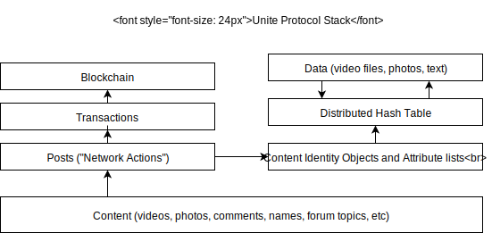

# Unite documentation

The Unite codebase and protocol documentation live here. As things change, the
GitHub repository will generally contain the most up-to-date information.

This is pre-alpha software, so documentation may prove to be both incomplete
and inaccurate, or even missing altogether. As development progresses, this
may change.

## Introduction

The Unite application relies on the Unite protocol to function. The Unite
protocol, similar to the ,
is comprised of several layers.

### Data Layer

The lowest-level layer is the data layer. This is the layer at which
transactions are added to the blockchain and hashes to the DHT. This layer
concerns itself with defining data structures, reliably resolving hashes to
data, and filtering out Unite data from other unrelated noise.

### Content Layer

The content layer is abstracted on top of the data layer. The content layer does
not care which/ blockchain/DHT is used (or even if they are used), and is
generally only concerned with delivering, routing, and displaying the
appropriate content to the correct users.
